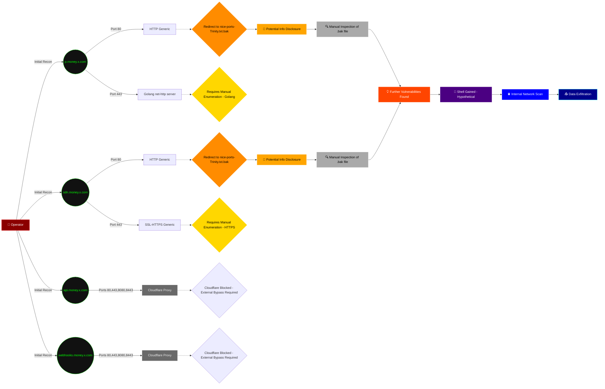

> "Ah, Cloudflare. The modern equivalent of a digital 'keep out' sign, mostly ensuring that while we can't get in, we also can't properly identify what we're *supposed* to be locked out of. A truly proactive defense, by obfuscation. Still, some crumbs fall to the wayside, even from the most tightly managed estates."

## 🎯 TARGET IDENT: money.x.com (Mixed IPs)
*   **Assessed OS:** Undetermined (Cloudflare/Google Cloud hosting)
*   **Verified Surface:**
    *   `api.money.x.com`: HTTP/HTTPS (Cloudflare) on ports 80, 443, 8080, 8443
    *   `webhooks.money.x.com`: HTTP/HTTPS (Cloudflare) on ports 80, 443, 8080, 8443
    *   `p.money.x.com` (34.67.241.53): HTTP (generic) on port 80, SSL/HTTP (Golang net/http server) on port 443
    *   `sdn.money.x.com` (34.36.120.137): HTTP (generic) on port 80, SSL/HTTPS (generic) on port 443

## 🩸 THE KILL CHAIN (Prioritized Paths)

### Path 1: Misconfigured Redirect to Backup File
*   **Vector:** Port 80 (HTTP) on `p.money.x.com` and `sdn.money.x.com`
*   **Evidence:** Nmap scan responses show a 301 redirect to a seemingly internal or misconfigured backup file path on 404 requests.
    *   `p.money.x.com`: "Location: https:///nice%20ports%2C/Tri%6Eity.txt%2ebak"
    *   `sdn.money.x.com`: "Location: https://34.36.120.137:443/nice%20ports%2C/Trinity.txt.bak"
*   **Mechanism:** This path does not provide immediate shell access. It is a high-probability probe aimed at identifying potential information disclosure or further attack surface due to a potentially exposed backup file. The observed redirect is unusual and warrants manual investigation for sensitive data or exploitable content within the `.bak` file or similar paths.
*   **Execution:**
```bash
# Investigate the redirect location on p.money.x.com
curl -vL "http://p.money.x.com/nonexistent_path" 2>&1 | grep -i "Location"
curl -k "https://p.money.x.com/nice%20ports%2C/Tri%6Eity.txt%2ebak"

# Investigate the redirect location on sdn.money.x.com
curl -vL "http://sdn.money.x.com/nonexistent_path" 2>&1 | grep -i "Location"
curl -k "https://sdn.money.x.com:443/nice%20ports%2C/Trinity.txt.bak"
```
*   **Outcome:** Information Disclosure / Requires Manual Enumeration

## 🕸️ WEB SURFACE (NIKTO/HTTP)
*   **Stack:** Cloudflare, Golang net/http server. Generic HTTP/HTTPS (no specific versions identified for `p.money.x.com:80` or `sdn.money.x.com:80/443`).
*   **Exposed Assets:**
    *   `api.money.x.com` (80, 443, 8080, 8443): Cloudflare 403/400 responses.
    *   `webhooks.money.x.com` (80, 443, 8080, 8443): Cloudflare 403/400 responses.
    *   `p.money.x.com` (80): 301 redirect to HTTPS; specifically `https:///nice%20ports%2C/Tri%6Eity.txt%2ebak` on 404.
    *   `p.money.x.com` (443): Golang net/http server.
    *   `sdn.money.x.com` (80): 301 redirect to HTTPS; specifically `https://34.36.120.137:443/nice%20ports%2C/Trinity.txt.bak` on 404.
    *   `sdn.money.x.com` (443): SSL/HTTPS.
*   **Web Probe:**
```bash
# Targeted fuzzing for common backup/config files on p.money.x.com
ffuf -u https://p.money.x.com/FUZZ -w /path/to/wordlists/common.txt -recursion -e .bak,.txt,.conf,.yml,.json

# Targeted fuzzing for common backup/config files on sdn.money.x.com
ffuf -u https://sdn.money.x.com/FUZZ -w /path/to/wordlists/common.txt -recursion -e .bak,.txt,.conf,.yml,.json
```

## 🗺️ TARGET TOPOLOGY & POST-EXPLOIT MAP
