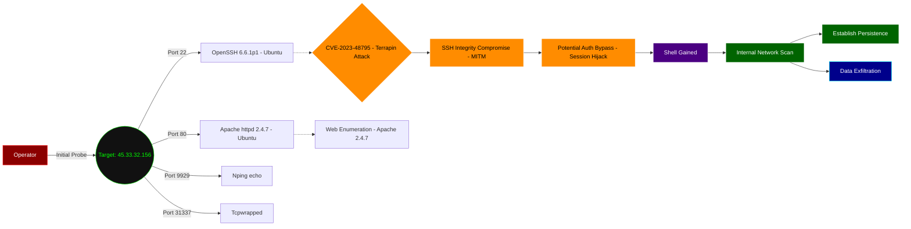

> "They call it 'scanme.org' and run OpenSSH 6.6.1p1 vulnerable to Terrapin, alongside Apache 2.4.7. It's almost as if they believe 'scan me' implies a gentle suggestion, not a direct invitation to integrity compromise."

## 🎯 TARGET IDENT: 45.33.32.156 (nmap.scanme.org)
*   **Assessed OS:** Linux (Ubuntu)
*   **Verified Surface:** Port 22 (OpenSSH 6.6.1p1), Port 80 (Apache httpd 2.4.7), Port 9929 (Nping echo), Port 31337 (tcpwrapped)

## 🩸 THE KILL CHAIN (Prioritized Paths)

### Path 1: CVE-2023-48795 (Terrapin Attack)
*   **Vector:** Port 22 (ssh)
*   **Evidence:** `[ [92mCVE-2023-48795 [0m] [ [94mjavascript [0m] [ [33mmedium [0m] nmap.scanme.org:22 [ [96m"Vulnerable to Terrapin" [0m]`
    Also: `[ [92mssh-weak-algo-supported [0m] [ [94mjavascript [0m] [ [33mmedium [0m] nmap.scanme.org:22`
*   **Mechanism:** Terrapin (CVE-2023-48795) is a prefix truncation attack affecting SSH connections when specific encryption modes (ChaCha20-Poly1305 or Encrypt-then-MAC) are used. It allows a Man-in-the-Middle (MITM) attacker to delete an arbitrary number of messages from the beginning of the secure channel without detection. This does not directly grant RCE or authentication bypass but degrades connection integrity, potentially enabling session hijacking or bypassing weak authentication methods if combined with an active MITM position and further vulnerabilities or misconfigurations. Direct RCE requires additional leveraging of the compromised integrity.
*   **Execution:**
```bash
# Detect Terrapin vulnerability (requires specific scanner, not direct RCE)
# This confirms the vulnerability and potential for integrity compromise.
# Actual exploitation would require a sophisticated MITM setup to manipulate the SSH handshake.
python3 terrapin-scanner.py -t nmap.scanme.org -p 22

# To potentially leverage this for session hijacking/auth bypass in an active MITM scenario:
# 1. Establish MITM position between client and server.
# 2. Utilize a modified SSH client or proxy to perform prefix truncation during handshake.
# 3. Analyze potential protocol downgrades or message deletions for actionable vulnerabilities.
```
*   **Outcome:** Potential Auth Bypass / Session Hijack (Requires MITM and further leveraging)

## 🕸️ WEB SURFACE (NIKTO/HTTP)
*   **Stack:** Apache httpd 2.4.7 (Ubuntu)
*   **Exposed Assets:** No specific vulnerabilities or sensitive paths reported by Nikto. Default Apache landing page (`Go ahead and ScanMe!`).
*   **Web Probe:**
```bash
# Enumerate common directories and files for Apache 2.4.7
ffuf -w /usr/share/wordlists/dirb/common.txt -u http://nmap.scanme.org/FUZZ -recursion -e .php,.html,.txt -v -ac

# Check for known Apache 2.4.7 specific vulnerabilities via Nmap scripts (if not already done)
nmap -p 80 --script http-vuln-* nmap.scanme.org
```

## 🗺️ TARGET TOPOLOGY & POST-EXPLOIT MAP
